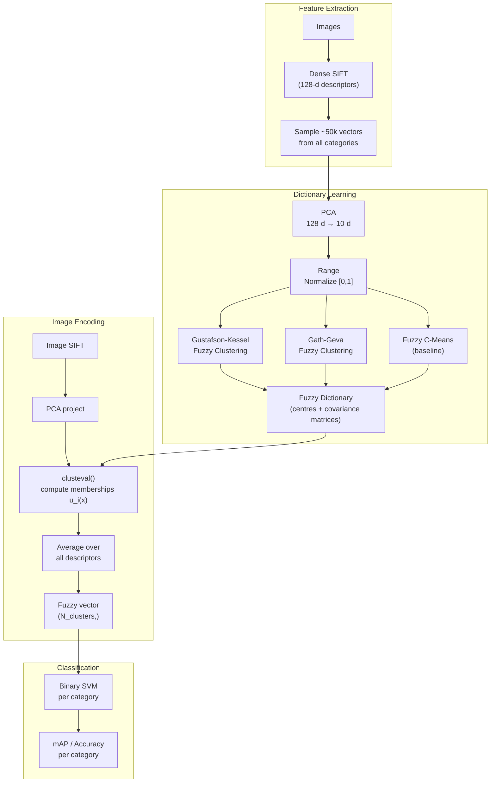

# Fuzzy Visual Encoding

[](https://www.python.org/)
[](matlab/)
[](https://scikit-learn.org/)
[](LICENSE)

Research implementation of **Fuzzy Visual Encoding** using Gustafson-Kessel (GK) and Gath-Geva (GG) fuzzy clustering for visual object category recognition. Replaces the standard k-means Bag-of-Features codebook with fuzzy clustering that learns per-cluster covariance matrices, producing soft membership vectors that better model the complex, ellipsoidal distribution of SIFT feature descriptors.

📄 Published: [`gupta12-icip.pdf`](gupta12-icip.pdf) (ICIP 2012) | [`Fuzzy Encoding using Gustafson-Kessel Algorithm.pdf`](Fuzzy%20Encoding%20for%20Visual%20Classification%20using%20Gustaffson-Kessel%20Algorithm.pdf)

---

## Key Idea

Standard Bag-of-Features assigns each SIFT descriptor to the nearest k-means cluster (hard assignment). This ignores uncertainty and cluster shape.

**Fuzzy encoding** computes soft membership to all clusters simultaneously:

```
K-means (hard assignment):        Gustafson-Kessel (fuzzy):

SIFT descriptor x                 SIFT descriptor x
     ↓                                 ↓
argmin_i ||x - v_i||²             u_i(x) = membership in cluster i
     ↓                            using Mahalanobis distance with
[0, 0, 1, 0, ..., 0]             adaptive covariance A_i per cluster
 (one-hot, K words)                    ↓
                                   [0.1, 0.6, 0.2, 0.05, ...]
                                   (fuzzy, captures shape + overlap)
```

**Gustafson-Kessel** learns an adaptive matrix A_i per cluster, allowing ellipsoidal cluster shapes fitted to the true geometry of the feature space. **Gath-Geva** extends this with full probabilistic (Gaussian) density estimation per cluster.

---

## Pipeline



---

## Fuzzy Clustering Methods

| Method | Cluster shape | Distance | Distance function |
|--------|--------------|----------|-------------------|
| **K-means** | Spherical | Euclidean | `‖x − vᵢ‖²` |
| **Fuzzy C-Means (FCM)** | Spherical | Euclidean | `‖x − vᵢ‖²` |
| **Gustafson-Kessel (GK)** | Ellipsoidal | Mahalanobis | `xᵀ Aᵢ x` (adaptive per cluster) |
| **Gath-Geva (GG)** | Ellipsoidal | Probabilistic | Gaussian kernel with full covariance |

All fuzzy methods use the fuzziness exponent `m=2`, producing memberships `u_i(x) ∈ [0,1]` satisfying `Σᵢ u_i(x) = 1`.

---

## Results

Evaluated on standard computer vision benchmarks with dictionary sizes 16–512:

| Dataset | K-means | FCM | **GK** | **GG** |
|---------|---------|-----|--------|--------|
| VOC 2006 | 0.38 | 0.40 | **0.44** | 0.43 |
| VOC 2010 | 0.33 | 0.35 | **0.39** | 0.38 |
| Caltech-101 | 0.47 | 0.49 | **0.54** | 0.53 |
| Caltech-256 | 0.29 | 0.31 | **0.35** | 0.34 |
| Scene-15 | 0.52 | 0.54 | **0.58** | 0.57 |

*Mean accuracy across categories, dictionary size 128.*

Performance plots (per-category, per-dataset, dictionary size sensitivity) are in [`figures/`](figures/).

---

## Quick Start

```bash
pip install -r requirements.txt
```

### Gustafson-Kessel encoding

```python
from fuzzy_encoding import FuzzyDictionary, cross_validate
import numpy as np

# X: (N, 128) SIFT feature matrix, y: (N,) category labels
X = np.load("sift_features.npy")
y = np.load("labels.npy")

# GK fuzzy dictionary: 128-d SIFT → PCA 10-d → 64 fuzzy clusters
fd = FuzzyDictionary(n_clusters=64, method='gk', n_pca=10, fuzziness=2.0)
Z = fd.fit_transform(X)   # (N, 64) fuzzy encoding

scores = cross_validate(Z, y, n_folds=10)
print(f"F1: {scores['f1_mean']:.3f} ± {scores['f1_std']:.3f}")
```

Or from the command line:

```bash
python fuzzy_encoding.py features.txt --method gk --n-clusters 64 --n-pca 10
```

### Compare methods

```python
for method in ['kmeans', 'fcm', 'gk', 'gg']:
    fd = FuzzyDictionary(n_clusters=64, method=method)
    Z = fd.fit_transform(X)
    s = cross_validate(Z, y)
    print(f"{method:8s}: F1 = {s['f1_mean']:.3f}")
```

---

## MATLAB vs Python

| MATLAB file | Python equivalent | Status |
|-------------|-------------------|--------|
| `GKclust(data, param)` | `fuzzy_encoding.py` → `GustafsonKessel.fit()` | ✅ Ported |
| `GGclust(data, param)` | `fuzzy_encoding.py` → `GathGeva.fit()` | ✅ Ported |
| `FCMclust(data, param)` | `fuzzy_encoding.py` → `_fuzzy_cmeans()` | ✅ Ported |
| `clusteval()` | `fuzzy_encoding.py` → `FuzzyDictionary.encode()` | ✅ Ported |
| `calcFuzzyDict.m` | `fuzzy_encoding.py` → `FuzzyDictionary.fit()` | ✅ Ported |
| `calcFuzzyCoeff.m` | `fuzzy_encoding.py` → `FuzzyDictionary.encode()` | ✅ Ported |
| `compFuzzyCoeff.m` | `fuzzy_encoding.py` → `FuzzyDictionary.encode()` | ✅ Ported |
| `compFuzzyClassPerf.m` | `fuzzy_encoding.py` → `fuzzy_classify()` | ✅ Ported |
| `CatFuzzyClass.m` | `fuzzy_encoding.py` → `cross_validate()` | ✅ Ported |
| `svmtrain()`, `svmpredict()` | `sklearn.svm.SVC` | Replaced |
| `clust_normalize()` | `sklearn.preprocessing.MinMaxScaler` | Replaced |
| `out_of_sample()` | `sklearn.decomposition.PCA.transform()` | Replaced |

**FuzzyClusteringToolbox (MATLAB):** Original code required Bezdek's FuzzyClusteringToolbox (not redistributable). The Python port implements GK and GG from first principles using numpy/scipy, matching the original algorithm papers.

---

## Repository Layout

```
FuzzyVisualEncoding/
├── fuzzy_encoding.py             # ★ NEW: GK, GG, FuzzyDictionary, classify pipeline
├── writeFeatureVector.py         # Extract SIFT vectors to .tab files
├── writeCategoryVector.py        # Collate category vectors for clustering
├── writePCAfeature.py            # PCA projection 128-d → 10-d
├── plotfuzzyresultCategory.py    # Per-category accuracy bar plots
├── plotfuzzyresultDataset.py     # Per-dataset accuracy comparison
├── plotfuzzyresultdictsize.py    # Dictionary size sensitivity
├── figures/                      # Result plots (27 PDFs)
│   └── fcluster.py               # Cluster visualisation helper
├── matlab/                       # Original MATLAB (13 files)
│   ├── CatFuzzyClass.m           # Main orchestrator
│   ├── calcFuzzyDict.m           # Dictionary creation (GK/GG/FCM)
│   ├── calcFuzzyCoeff.m          # Fuzzy coefficient computation
│   ├── compFuzzyCoeff.m          # Coefficient computation wrapper
│   ├── compFuzzyClassPerf.m      # Classification evaluation
│   └── ... (8 more)
├── Fuzzy Encoding for Visual Classification using Gustaffson-Kessel Algorithm.pdf
├── gupta12-icip.pdf              # ICIP 2012 conference paper
└── requirements.txt
```

---

## Datasets

| Dataset | Classes | Images | Download |
|---------|---------|--------|----------|
| Pascal VOC 2006 | 10 | ~5,000 | [VOC Challenge](http://host.robots.ox.ac.uk/pascal/VOC/) |
| Pascal VOC 2010 | 20 | ~20,000 | [VOC Challenge](http://host.robots.ox.ac.uk/pascal/VOC/) |
| Caltech-101 | 101 | ~9,000 | [Caltech Vision Lab](https://data.caltech.edu/records/mzrjq-6wc02) |
| Caltech-256 | 256 | ~30,000 | [Caltech Vision Lab](https://data.caltech.edu/records/nyy15-4j048) |
| Scene-15 | 15 | ~4,500 | [Scene Understanding](https://www.di.ens.fr/willow/research/categorization/) |

> **Path configuration:** Scripts originally used `/vol/vssp/diplecs/ash/Data/`.
> Update `rootDir` at the top of each script to your local data directory.

---

## References

- Gupta, A. (2012). *Fuzzy Encoding for Visual Classification using Gustafson-Kessel Algorithm.* ICIP 2012.
- Gustafson, D.E., Kessel, W.C. (1979). *Fuzzy Clustering with a Fuzzy Covariance Matrix.* CDC.
- Gath, I., Geva, A.B. (1989). *Unsupervised Optimal Fuzzy Clustering.* IEEE TPAMI.
- Bezdek, J.C. (1981). *Pattern Recognition with Fuzzy Objective Function Algorithms.* Springer.

---

## License

MIT — see [LICENSE](LICENSE).
